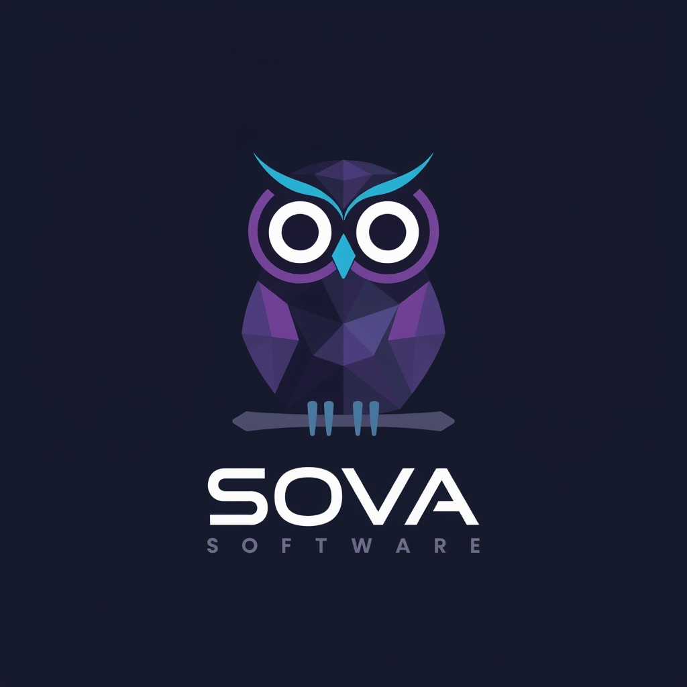

# SOVA -- Software Orchestration Via Agents

<p align="center">
  
</p>

[](https://github.com/xsovad06/project-automation-kit/actions/workflows/ci.yml)

## What is SOVA?

SOVA is a standalone application that turns GitHub Issues into merged pull requests -- autonomously. Install it into any software project and it will triage issues, research the codebase, develop solutions using TDD, self-review, create PRs, monitor CI, and address review feedback. You stay in control through a web dashboard and a human-in-the-loop handoff system, while SOVA handles the repetitive engineering work.

## Key Features

- **Role-Based Agents** -- specialized triage, researcher, developer, and reviewer roles with automatic dispatch
- **Gate-Checked Pipeline** -- every step validates its output before the next begins
- **Web Dashboard** -- 12-page UI for monitoring runs, costs, agent control, and memory
- **24/7 Server Mode** -- scheduler with priority-based watch loop and parallel execution
- **Handoff System** -- agents pass state to each other; dashboard renders action buttons for human decisions
- **22 Standardized Commands** -- develop, test, review, PR, debug, and more -- works on any project
- **4-Tier Knowledge System** -- layered memory with cross-project learning ([details](knowledge/KNOWLEDGE.md))
- **Persona Auto-Detection** -- detects your tech stack and loads relevant guidance (see [`personas/`](personas/))
- **Pluggable Task Sources** -- GitHub Issues today, JIRA and Linear planned

## Architecture Overview


Each transition is enforced by gate checks. The Developer refuses issues that haven't been triaged and researched first (use `--force` to bypass for quick fixes).

## Requirements

- Python 3.12+
- [Claude Code CLI](https://docs.anthropic.com/en/docs/claude-code) (`claude`)
- [GitHub CLI](https://cli.github.com/) (`gh`) -- authenticated
- `git`
- `terminal-notifier` (macOS, optional) -- `brew install terminal-notifier` for rich desktop notifications with custom icon and sound

## Installation

```bash
git clone https://github.com/xsovad06/project-automation-kit.git
cd project-automation-kit
pip install --user -e .
```

Ensure your Python user bin directory is on `PATH`:

```bash
# macOS (replace 3.12 with your Python version)
export PATH="$HOME/Library/Python/3.12/bin:$PATH"

# Linux
export PATH="$HOME/.local/bin:$PATH"
```

For development (tests, linting):

```bash
pip install --user -e ".[dev]"
```

## Quick Start

```bash
# Install SOVA into your project (creates sova.toml, deploys commands)
sova install /path/to/project

# Optional: run the interactive setup wizard for custom configuration
sova setup /path/to/project

# Triage an issue to assess agent suitability
sova triage 42

# Work on an issue (runs the full pipeline: develop, test, review, PR)
sova run 42

# Or start the server for fully autonomous operation
sova server start
```

## Dashboard

The web dashboard is SOVA's primary interface for monitoring and controlling agents.

```bash
sova dashboard --project /path/to/project    # http://localhost:8111
```

<!-- screenshot: dashboard overview -->

Pages include: Dashboard (overview), Agents (multi-agent control), Work (issue-centric run history), Costs, Queue (batch operations), Logs, Settings, Memory, and Setup.

## Configuration

SOVA uses a `sova.toml` file in each project root. Minimal example:

```toml
github_repo = "owner/repo"
github_user = "owner"
base_branch = "main"

[task_source]
type = "github"
```

All settings have sensible defaults. For the full configuration reference, see [`sova/config/models.py`](sova/config/models.py).

Environment variables override TOML values using the `SOVA_` prefix (e.g., `SOVA_BASE_BRANCH=develop`).

## CLI Reference

| Category | Commands |
|----------|----------|
| **Core** | `sova run <issue>`, `sova triage <issue>`, `sova harden <issue>`, `sova watch`, `sova parallel` |
| **Server** | `sova server start\|stop\|status` |
| **Setup** | `sova install <path>`, `sova setup <path>`, `sova init-db` |
| **PR Ops** | `sova address-pr <pr>`, `sova maintain-pr <pr>`, `sova review-pr <pr>`, `sova learn-from-pr <pr>` |
| **Monitor** | `sova status`, `sova costs`, `sova config`, `sova dashboard` |
| **Knowledge** | `sova memory search <query>`, `sova memory prune` |
| **Commands** | `sova commands list\|diff\|update` |
| **Maintenance** | `sova cleanup`, `sova migrate config\|costs` |

Run `sova --help` for the full list.

## How It Works

SOVA uses a **role-based architecture** with four specialized agent types:

1. **Triage** -- assesses issues for agent suitability, applies labels (`agent:ready`, `agent:needs-spec`, `agent:human-only`)
2. **Researcher** -- investigates the codebase and writes an implementation spec
3. **Developer** -- implements the solution using TDD, creates a PR, monitors CI
4. **Reviewer** -- reviews the PR, posts findings, triggers a fix cycle if needed

Agents are **ephemeral**: each one spawns, does its job, writes a handoff file, and exits. The orchestrator (scheduler or dashboard) reads the handoff and spawns the next agent in the chain. This continues autonomously until a human decision is needed, at which point SOVA sends a notification and waits.

## Task Sources

| Source | Status |
|--------|--------|
| GitHub Issues | Supported |
| JIRA | Planned |
| Linear | Planned |

## Contributing

Contributions are welcome. Development commands:

```bash
make check    # Lint + test (CI-equivalent)
make lint     # ShellCheck + Ruff
make test     # All tests (bash + python)
make format   # Auto-format Python
```

## License

Licensed under the [Apache License, Version 2.0](LICENSE).
