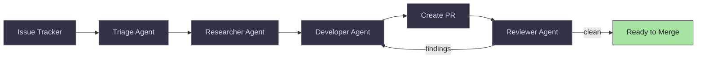

# SOVA -- Software Orchestration Via Agents

[](https://github.com/xsovad06/project-automation-kit/actions/workflows/ci.yml)

<p align="center">
  
</p>

## What is SOVA?

SOVA is a standalone application that gives any software project autonomous AI-assisted development. Point it at your issue tracker, and it triages issues, develops solutions using TDD, self-reviews code, creates pull requests, monitors CI, addresses review feedback, and learns from mistakes -- all without human intervention. Install once, configure your repo, and let SOVA work through your backlog 24/7.

## Key Features

- **Role-Based Agents** -- specialized triage, researcher, developer, and reviewer roles with automatic dispatch
- **Mandatory Pipeline** -- Triage -> Research -> Develop with gate checks between every step
- **22 Standardized Commands** -- develop, test, review, PR, debug, and more -- works on any project
- **Web Dashboard** -- 12-page UI for monitoring runs, costs, agent control, memory, and configuration
- **24/7 Server Mode** -- priority-based watch loop with parallel agent execution
- **Handoff System** -- agents write state for the next agent; dashboard renders action buttons
- **Knowledge System** -- 4-tier layered knowledge with cross-project learning ([details](knowledge/KNOWLEDGE.md))
- **Persona System** -- auto-detects your tech stack and loads relevant guidance
- **Pluggable Task Sources** -- GitHub Issues today, with JIRA and Linear planned

## Architecture Overview



Each agent is **ephemeral**: it spawns, does its work, writes a handoff file, and exits. The dashboard or scheduler reads the handoff and spawns the next agent in the chain. The pipeline is enforced -- the Developer refuses issues that have not been triaged and researched (use `--force` to bypass for quick fixes).

## Requirements

- Python 3.12+
- [Claude Code CLI](https://docs.anthropic.com/en/docs/claude-code) (`claude`)
- [GitHub CLI](https://cli.github.com/) (`gh`) -- authenticated
- `git`

## Installation

```bash
git clone https://github.com/xsovad06/project-automation-kit.git ~/sova
pip install -e ~/sova
```

This installs the `sova` command. Ensure your Python user bin directory is on PATH:

```bash
# macOS
export PATH="$HOME/Library/Python/3.x/bin:$PATH"

# Linux
export PATH="$HOME/.local/bin:$PATH"
```

## Quick Start

```bash
# Install SOVA into your project (creates sova.toml, copies commands)
sova install /path/to/project

# Optional: run the interactive setup wizard for customized config
sova setup /path/to/project

# Triage an issue -- SOVA assesses it and labels it for agent suitability
sova triage 42

# Work on an issue -- full pipeline: develop, test, review, create PR
sova run 42

# Or start the server for fully autonomous operation (dashboard + scheduler)
sova server start
```

## Dashboard

The web dashboard is the primary interface for controlling agents and monitoring work. Start it with `sova dashboard --project /path/to/project` or `sova server start`, then visit `http://localhost:8111`.

<!-- screenshot: dashboard overview -->

Pages include: Dashboard overview, Agents (multi-agent control), Work (issue-centric view), Run detail, Costs, Queue (batch operations), Logs, Settings, Memory, Setup wizard, and Style guide.

## Configuration

SOVA uses a `sova.toml` file per project. A minimal configuration:

```toml
github_repo = "owner/repo"
base_branch = "main"
test_cmd = "make test"
lint_cmd = "make lint"

[task_source]
type = "github"
```

All settings have sensible defaults and can be overridden via environment variables with the `SOVA_` prefix (e.g., `SOVA_BASE_BRANCH=develop`). Run `sova setup` for an interactive wizard, or see `sova/config/models.py` for the full configuration reference.

## CLI Reference

| Category | Commands |
|----------|----------|
| **Core** | `sova run <issue>`, `sova triage <issue>` |
| **Server** | `sova server start\|stop\|status` |
| **Setup** | `sova install <path>`, `sova setup <path>` |
| **PR Ops** | `sova address-pr <pr>`, `sova maintain-pr <pr>`, `sova review-pr <pr>`, `sova learn-from-pr <pr>` |
| **Monitor** | `sova status`, `sova costs`, `sova dashboard` |
| **Knowledge** | `sova memory search <query>`, `sova memory prune` |
| **Commands** | `sova commands list\|diff\|update` |
| **Maintenance** | `sova cleanup`, `sova migrate config\|costs` |

## How It Works

SOVA uses four specialized agent roles that form an enforced pipeline:

1. **Triage** -- assesses an issue for agent suitability and labels it (`agent:ready`, `agent:needs-spec`, `agent:needs-research`, or `agent:human-only`)
2. **Researcher** -- investigates the codebase, identifies relevant files, and writes a technical specification
3. **Developer** -- implements the solution using TDD, runs lint and tests, simplifies the code, self-reviews, creates a PR, and monitors CI
4. **Reviewer** -- reviews the PR and posts findings; if issues are found, the Developer is automatically respawned to address them

The Developer runs a 12-step pipeline with gate checks between every step -- each step must validate its output before the next one starts. Agents communicate through a JSON-based handoff protocol: each agent writes its state to a handoff file, and the dashboard or scheduler reads it to spawn the next agent.

## Task Sources

| Source | Config | Status |
|--------|--------|--------|
| GitHub Issues | `type = "github"` | Ready |
| JIRA | `type = "jira"` | Planned |
| Linear | `type = "linear"` | Planned |

## Contributing

Contribution guidelines are coming soon. For now, see `AGENTS.md` for coding conventions and `CLAUDE.md` for development commands.

## License

Licensed under the [Apache License, Version 2.0](LICENSE).
